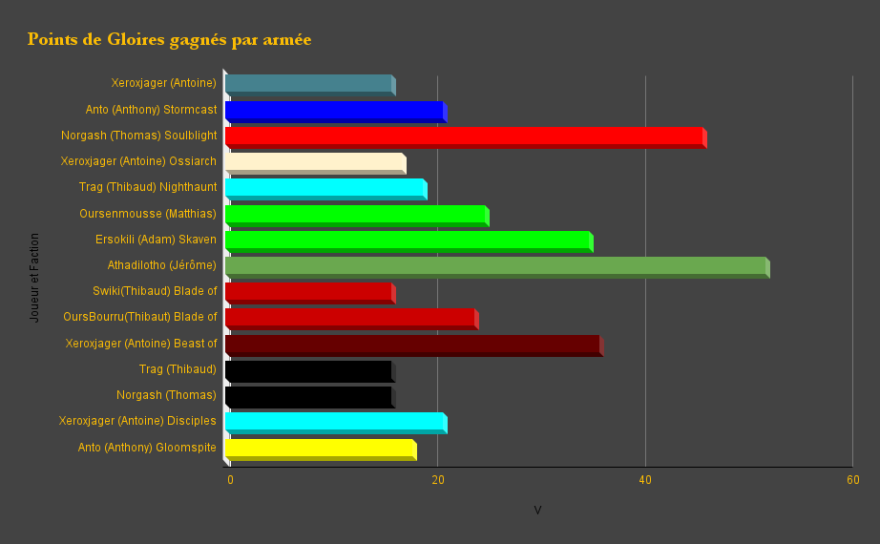
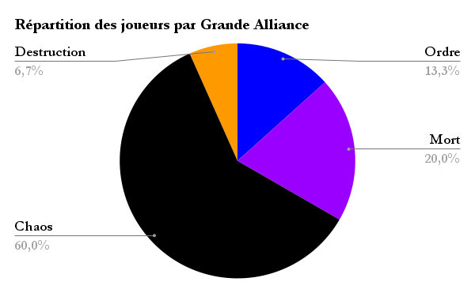

[.campagne]
--
Dans l'immensité des Royaumes Mortels, où les échos des batailles résonnent à travers les âges, une ère de conflits incessants a forgé des légendes vivantes. Des armées, menées par des joueurs audacieux et stratèges, ont traversé le feu de nombreux affrontements, chacun plus déterminant que le dernier. Ces batailles, véritables tourments d'acier et de magie, n'étaient pas de simples luttes pour la survie, mais des opportunités pour les valeureux de s'élever au-dessus des mortels.

Au cœur de ces tumultes, chaque victoire arrachée aux griffes de l'adversité n'était pas seulement un triomphe, mais une chance de croissance et d'expansion. Les armées des joueurs, baignées dans le sang de leurs ennemis, ont vu leurs rangs s'épaissir avec l'arrivée de nouvelles unités. Guerriers et créatures, attirés par les récits de bravoure et la promesse de gloire, ont rejoint les étendards de ces seigneurs de guerre, prêts à forger leur propre légende.

Mais ce n'était pas tout. Les affrontements titanesques, où se mêlaient le fracas des armes et les incantations ancestrales, ont également permis aux armées de découvrir des pouvoirs oubliés. Les sorciers et prêtres, inspirés par les actes héroïques de leurs compagnons, ont débloqué de nouveaux sortilèges et bénédictions, augmentant ainsi leur arsenal mystique. Ces nouvelles compétences, nées dans le tumulte des batailles, promettaient de remodeler le cours des futurs affrontements.

Dans les ruines des champs de bataille, parmi les débris et les reliques des âges passés, des artefacts de grande puissance ont été découverts. Forgés par des mains inconnues ou bénis par les dieux eux-mêmes, ces objets étaient imprégnés de magies anciennes. Les joueurs, reconnaissant le potentiel de ces trésors, se sont empressés de les revendiquer, offrant à leurs armées de nouveaux avantages et stratégies. Ces artefacts, chacun porteur d'une histoire et d'un pouvoir uniques, ont inspiré les troupes et intimidé les ennemis.

Ainsi, à travers le fer et le feu, les armées des joueurs se sont renforcées, devenant des forces avec lesquelles il fallait compter. Chaque nouvelle unité, chaque nouveau pouvoir et chaque nouvel artefact acquis dans le sillage des batailles était un témoignage de leur détermination et de leur habileté. L'histoire des Royaumes Mortels est tissée de ces conquêtes et de ces découvertes, et les récits de ces héros continueront à inspirer tant que les étoiles brilleront dans le ciel nocturne.
--

De nombreuses batailles se sont déroulées pendant cette première période de campagne : 

* link:../posts/campagne/partie1[Seigneurs Ruinemânes VS Séraphon]
* link:../posts/campagne/partie2[Bêtes du Chaos VS Putrescent de Nurgle]
* link:../posts/campagne/partie3[Skaven VS Lames de Khorne VS Esclaves des Ténèbres]
* link:../posts/campagne/partie4[Bête du Chaos VS Putrescent de Nurgle VS Skaven]
* link:../posts/campagne/partie5[Putrescent de Nurgle VS Seigneurs Ruinemânes]
* link:../posts/campagne/partie6[Demons de Khorne VS Seigneurs Ruinemânes]
* link:../posts/campagne/partie7[Collecteurs Ossiarque VS Eternels de l'Orage]
* link:../posts/campagne/partie8[Esclaves des ténèbres VS Hantenuit]
* link:../posts/campagne/partie9[Disciples de Tzeentch VS Seigneur Ruinemânes VS Putrescent de Nurgle]
* link:../posts/campagne/partie10[Skavens VS Vils de Fielsobscur]
* link:../posts/campagne/partie11[Esclaves des Ténèbres VS Disciples de Tzeentch]
* link:../posts/campagne/partie12[Putrescent de Nurgle VS Seigneurs Ruinemânes]
* link:../posts/campagne/partie13[Putrescent de Nurgle & Kruleboyz VS Vils de Fielobscur & Seigneur Ruinemânes]

Ajoutons quelques graphiques pour conclure ce premier chapitre : 

Vous retrouvez les parties link:/tags/campagne/[avec une recherche par tags]