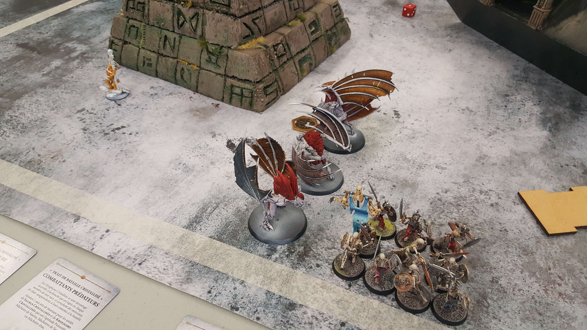
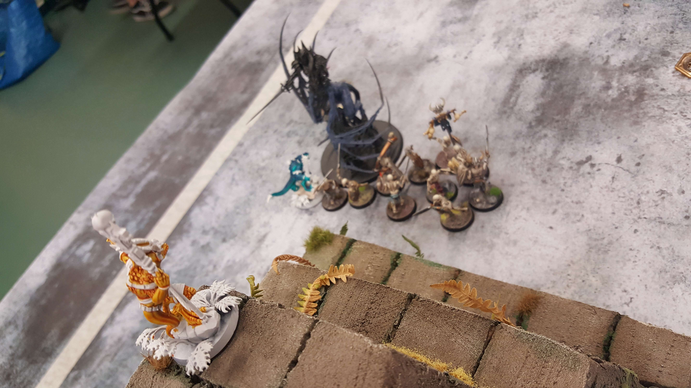

[.campagne]
--
Le première mission des Gardiens de Quetzl était de retrouver le Crâne de Cristal pour pouvoir convoquer un Slann depuis son vaisseau stellaire.
Alors que ses troupes investiguaient la jungle à proximité des pyramides sacrées, l'odorat développé de Ek'tak-copa lui fit prendre conscience que quelque chose approchait. Les recherches du Crâne de Cristal attendraient. Il fallait empêcher cette nouvelle menace de traverser les terres sacrées des anciens.

***

Varlicha et Mordouillou étaient sortis de leur bastion maudit pour retrouver la cape de brume et d'ombre. Leurs recherches les avaient menés sur un territoire où de nombreuses ruines pyramidales étaient regroupées. Grâce à ses siècles d'existence, Varlicha savait qu'ils avaient pénétré une jungle Séraphon. La cape devait se trouver dans un de ces temples. Le pillage pouvait commencer.

--

--

Les morts-vivants étaient en surnombre et surgissaient de toute part. Ek'tak-copa pensa donc que seul un assaut frontal aurait une infime chance de les arrêter avant qu'il ne soit trop tard
Les saurus furent surpris par la célérité des simples squelettes qui couraient aussi vite que l'horrible créature qui semblait les diriger. Les kroxigors encaissèrent la charge des morts avec douleur et tombèrent sous leurs trop nombreux coups.
Dans le carnage annoncé, Ektak-copa vit cependant la créature difforme qui semblait mener les cadavres ambulants. Il rassembla ses Kroxigors et ses lanciers et chargea l'hybride cauchemardesque.

***

Un grand Saurien sauta sur Varlicha. Il plongea son arme profondément dans le flanc de la vampire. Cela lui arracha un cri de douleur. Elle se retourna pour faire face à son adversaire. Sa corpulente forme lui permettait de le toiser, de le jauger. Il bougeait vite, esquivait et paraît ses coups de griffes, de crocs et de rapière.

Elle aperçut une ouverture mais déjà les lézards montés qui accompagnaient son adversaire étaient sur elle. Elle para du mieux qu'elle put les nombreuses attaques des créatures. Sa chair mutée était en lambeaux.
Mais la volonté de Nagash devait être accomplie.

***

La redoutable créature se défendait âprement. Elle arrivait à déplacer son corps difforme avec une vitesse surnaturelle. Elle mit à terre toute la cavalerie saurus. Ektak-copa s'apprêtait à achever la terrible bête qui lui faisait face quand elle se redressa, et plongea sa rapière dans le corps du vaillant saurus.

Lorsqu'il s'écroula, il vit des squelettes sortis de terre s'enfoncer plus profondément dans la jungle. Il aperçut également d'énormes créatures volantes fondre depuis le ciel et disparaître dans la végétation.
Bientôt il n'entendit plus que le cri rageur de la créature maudite et les hurlements de ses chevaucheurs qui se faisaient écharper.
Alors que sa vision se troublait, il vit les morts-vivants se ruer sur les corps de ses soldats. Ses autres sens ne lui firent parvenir que l'odeur et le goût du sang.
--

Victoire majeure de la cour écarlate de Varlicha
