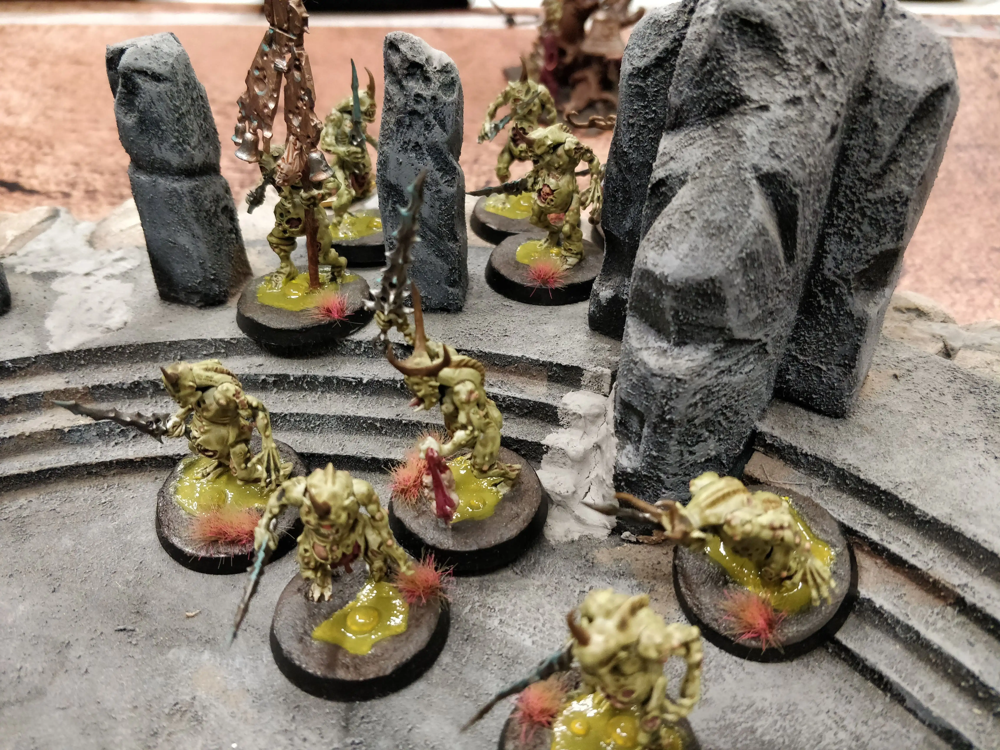

[.campagne]
--
Les ordres étaient clairs, il fallait retrouver l'artefact nommée l'Eplucheur.

Notre petit bataillon s'aventure vers la zone où est supposée être caché cet artefact.

Des Nurglings ont été envoyés en éclaireur.

Sur notre chemin, il nous faudra traverser une ancienne arène de combat, ou un site de rituel. L'artefact est caché plus loin.

Le sol était déjà contaminé ... non pas par les bienfaits de Nurgle, mais par de vils non-morts.

Trop confiant, nous nous sommes lancés dans la bataille et très rapidement les Pesticrates Putrides ont été écrasés, et le brave Gutrot Spume aussi.
--

--
Anapox le Répugnant et sa garde de PortePestes ont résisté autant qu'une mouche que l'on écrase sur un pustule. Deux Bêtes de Nurgle ont été invoquées, la première pour essayer de retenir une horde de squelettes, là aussi sans succès, et la seconde pour se jeter sur la recherche de l'artefact.

Kankeros sur sa mouche de la Peste a un peu déambulé sans se trouver une utilité. La chimère Varcha le cloua au sol.

Dans la douleur, l'artefact a été trouvé, mais a quel prix, seul les Nurgling et une bête invoqué ont survécu car ignoré par les ennemies.
--
image::./IMG20230830221820.webP[]

Victoire majeure des Seigneur Ruinemânes !
